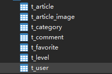

# 快速开始

## 本项目是简易的新闻发布系统，很简陋，有如下功能
### 1.登陆
### 2.注册
### 3.新闻发布
### 4.后台管理
### 5.新闻首页展示

### 6.新闻搜索


后端技术栈为`Spring`+  `SpringBoot`+`Mybatis`+`Mybatis-Plus`的Maven项目，使用IDEA开发

**resources**目录下包括了前端的html，css，js文件以及SpringBoot的配置文件

`application.yaml`的内容:
```yaml
spring:
  datasource:
    type: com.alibaba.druid.pool.DruidDataSource
    driver-class-name: com.mysql.cj.jdbc.Driver
    url: jdbc:mysql://localhost:3306/news_demo?serverTimezone=UTC
    username: root
    password: '016016'

mybatis-plus:
  mapper-locations: classpath:/mapper/*.xml
```
自行修改MySQL数据库url，用户名和密码字段   
**另外**，端口号修改在`application.properties`的`server.port=4514`中


鄙人只是想来练练手，前端的文件是网络上下载的，根据前端所需要的功能编写后端代码。
鄙人能力和精力不足,评论，收藏，用户等级，文章图片路径均未完成（被注释掉了，嘻嘻），多多见谅


提供文章，目录和用户的SQL文件(在项目的src目录下)

另外后台的管理系统现在默认是只有lid>=2才能登上后台，数据库里面就只有账户114514，密码114514的用户可以登陆反正到时候想怎么改都行，记住密码要用里面的MD5工具encode一遍再加入数据库才行（如果手动添加的话）不想再做过多的测试了，祝我好运，祝各位好运！

---
ps:MD也不会写……
